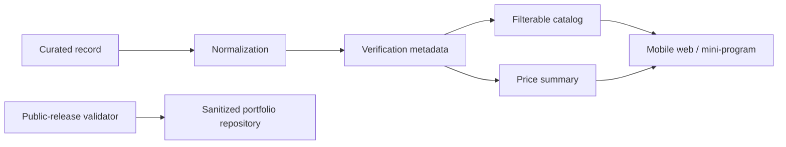

# Architecture and Product Rationale

## The problem shape

The original private project addressed a high-friction service-discovery journey: users need to compare channels, distinguish planned from urgent paths, and understand how recent each data point is. The portfolio edition preserves the decision model, not operational data.

## Data contract

Each catalog record has four independent dimensions:

| Dimension | Why it exists |
|---|---|
| `service_type` | Separates planned and urgent journeys. |
| `channel_type` | Avoids conflating a clinic, community route, and remote route. |
| `record_status` | Keeps usable and pending observations distinguishable. |
| `verification_level` | Makes evidence quality visible to downstream UI and analytics. |

The public data contract deliberately excludes addresses, phone numbers, user text, URLs, screenshots, and any unique operational identifiers.

## Aggregation rule

The summary function includes only rows whose `record_status` is `usable`. Pending rows still contribute to `review_or_excluded_count`, making uncertainty legible instead of silently discarded. This is a small but important product decision: an apparent price range should not be driven by a record that has not passed review.

## Public-release boundary

The private implementation may hold research material and deployment configuration needed for real operations. The public edition is a separate repository, rather than a branch of that implementation, so publishing it cannot expose historical Git objects or accidentally restore raw files through a later merge.
